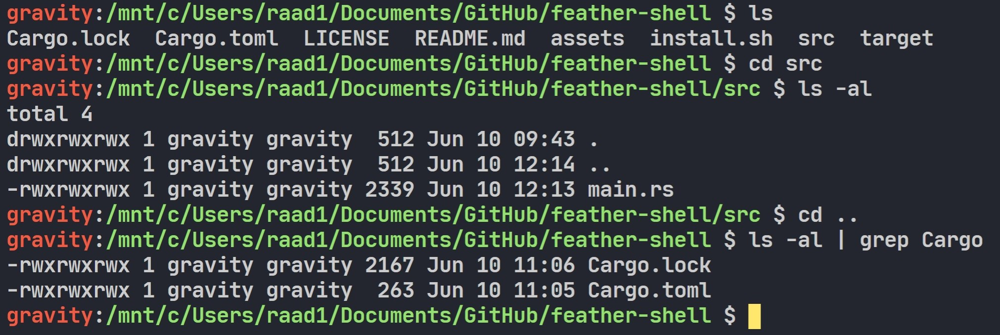
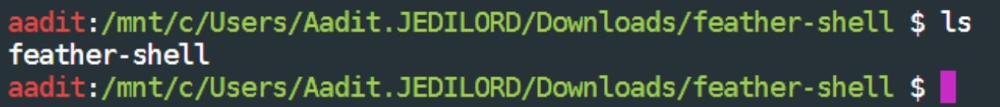
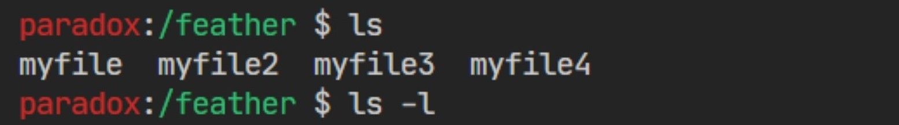

# feather-shell 
🕊 A custom linux shell written in Rust.
<br>

<br>

<br>


## 🔌 Installation
Install the [latest release](https://github.com/raad1masum/feather-shell/releases).

## 🚀 Local Development
```sh
./install.sh
cargo run
```
## 👨‍💻 Contact

Linkedin: [Raadwan Masum](https://www.linkedin.com/in/raadwan-masum-9147bb1a5)
<br>
Github: [raad1masum](https://github.com/raad1masum)
<br>
Devpost: [Raadwan masum](https://devpost.com/raad1masum)

## 🤝 Contributing

Contributions, PRs, issues and feature requests are welcome! Feel free to check out the [issues page](https://github.com/raad1masum/feather-shell/issues). 

## ❤️ Show your support

Give a ⭐️ if you liked this project!
Hope you enjoy!
