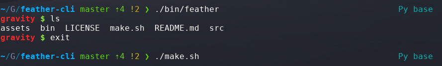

# feather-cli 
🕊 A super light, super-fast Linux CLI.
<br>
<br>


## 🔌 Installation
Install the [latest release](https://github.com/raad1masum/feather-cli/releases).

## 🚀 Local Development
```sh
./bin/feather
```
## 👨‍💻 Contact

Linkedin: [Raadwan Masum](https://www.linkedin.com/in/raadwan-masum-9147bb1a5)
<br>
Github: [raad1masum](https://github.com/raad1masum)
<br>
Devpost: [Raadwan masum](https://devpost.com/raad1masum)
